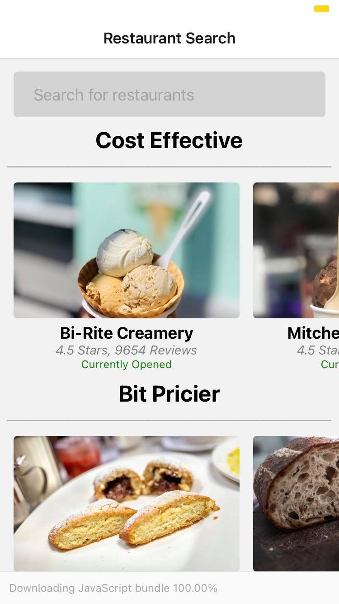

# RestaurantSearch Mobile Application

### App startup

#### 1) download the repo from github 
#### 2) go inside that directory in terminal 
#### 3) run "npm install" to download dependencies 
#### 4) to start the app run "npm start"
#### 5) scan the QR code with Camera app on iOS / scan the QR code with Expo Go app on Android / open it on emulator 

 

### Usage

RestaurantSearchApp is a simple mobile aplication which allows user to search for a certain term about food.
 
The app then communicates with an API and gives back the information about all restaurants nearby.
 
Clicking on the food image it show a detailed view of that restaurant
 
- owner's number 
- delivery number
- more images about certain term

 

### App interface
 

# Android 
 

  
      

# iOS
 

   
    

